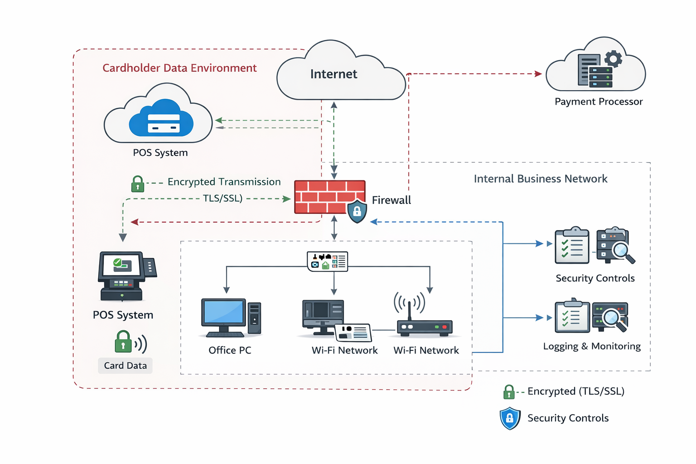

# 🔄 Data Flow Diagram (Cardholder Data)

## 📌 Overview

This diagram illustrates how **cardholder data flows** through the coffee shop environment and highlights the controls used to protect sensitive information.

---

## 📊 Diagram

---

## 💳 Cardholder Data Flow

1. Customer payment is initiated at the **POS system**
2. Card data is processed locally (minimal storage)
3. Data is transmitted securely using **TLS/SSL encryption**
4. Traffic passes through the **firewall boundary**
5. Data is sent to the **payment processor** over the internet

---

## 🔐 Security Controls in Flow

### 🔒 Encryption

* TLS/SSL used to protect data in transit
* Prevents interception or exposure

---

### 🔥 Firewall / Boundary Protection

* Controls traffic entering and leaving the network
* Restricts unauthorized communication

---

### 🧱 Segmentation (Key PCI Concept)

* POS system operates within a **Cardholder Data Environment (CDE)**
* Internal systems are logically separated
* Reduces scope and risk

---

### 📊 Logging & Monitoring

* Tracks activity related to:

  * POS transactions
  * Network traffic
* Supports detection and response

---

### 🔑 Access Control

* Ensures only authorized users can access systems
* Supports least privilege and authentication enforcement

---

## 🧭 Compliance Alignment

This data flow supports:

* NIST SP 800-53:

  * SC-8 (Transmission Confidentiality)
  * SC-7 (Boundary Protection)
  * AU-6 (Audit Review)

* PCI DSS Concepts:

  * Secure transmission of cardholder data
  * Network segmentation
  * Controlled access to sensitive systems

---

## 📌 Key Takeaway

This diagram demonstrates how sensitive data is:

* Identified
* Protected in transit
* Restricted through network controls

---

## Data Flow Summary

Payment transactions follow this general flow:

1. Customer presents payment card at POS terminal
2. POS system encrypts transaction data
3. Data is transmitted over the network to the payment processor
4. Authorization response is returned to the POS

Key considerations:

- Cardholder data is not stored by internal business systems
- Network segmentation separates POS traffic from internal systems and guest Wi-Fi
- Administrative access to systems occurs through controlled user accounts

This model reflects a simplified small business payment environment with minimal data retention and reliance on third-party processing.

---

## ⚠️ Note

This is a simplified representation for portfolio and educational purposes.

---
